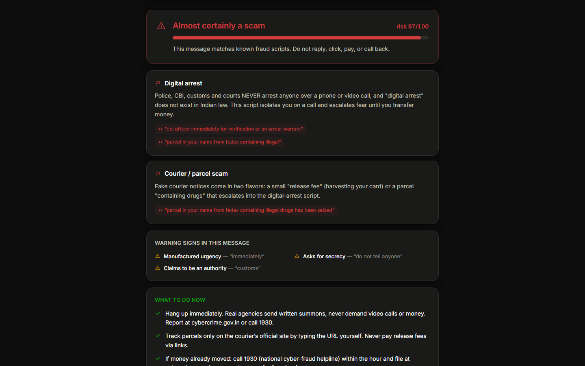

<div align="center">

# ScamLens

**Your fraud instincts are out of date.**

Paste any suspicious message. Get an instant verdict naming the exact scam
script — 100% in your browser, nothing uploaded.

</div>



## The problem nobody notices

AI made scams cheap. Cloned voices that sound like your daughter. Phishing
pages pixel-identical to your bank. Messages with perfect grammar from
"government officials." The instincts that protected people for decades —
*"it looked real"*, *"he sounded official"* — quietly stopped working, and
nobody got a memo about it.

But here's the asymmetry that still favors you: **scammers work from
scripts.** The digital-arrest call, the KYC-expiry SMS, the ₹3000-a-day task
job, the UPI collect trick — the packaging is AI-fresh, the script underneath
is the same. Scripts can be pattern-matched.

ScamLens knows 16 of them:

| | | |
|---|---|---|
| Digital arrest | UPI collect fraud | KYC / SIM expiry |
| Courier / parcel | Electricity disconnection | Task / job scams |
| Lottery & KBC prizes | Army-officer marketplace | Screen-share (AnyDesk) |
| OTP harvesting | Family emergency / voice clone | Investment "guaranteed returns" |
| Instant loan traps | Phishing links | "Wrong transfer" refunds |
| Video-call sextortion | | |

Each verdict names the pattern, quotes the exact evidence from the message,
lists every generic warning sign (manufactured urgency, secrecy demands,
credential requests…), and tells you precisely what to do — including the
**1930 helpline** and cybercrime.gov.in when money has already moved.

## Privacy is the architecture

The entire analysis engine ships to your browser as a static page. There is no
server, no logging, no analytics. The message you paste **never leaves your
device** — which matters, because the messages people need to check are often
embarrassing or scary.

## Run it

```bash
git clone https://github.com/ramsai676/scamlens
cd scamlens
npm install
npm run dev      # http://localhost:3000
npm test         # 32-case detection test suite (every pattern + benign controls)
npm run build    # static export to out/
```

Stack: Next.js 14 (static export) · TypeScript · Tailwind. The engine is
~200 lines of scored regex patterns in `lib/patterns.ts` — deliberately
simple, auditable, and easy to extend. Found a script we're missing?
PRs welcome: one pattern object + one test case.

## Share it with the person who needs it

This tool is most useful to the people least likely to find it — parents,
grandparents, anyone new to UPI. Send them the link. Better: paste a real scam
you received, screenshot the verdict, and show them what the scripts look like.

## Part of the "Unnoticed" series

Five problems people have but haven't noticed, five open-source tools, five
days. ScamLens is **3 of 5**.

## License

MIT — fork it, translate it, ship it to your community.
